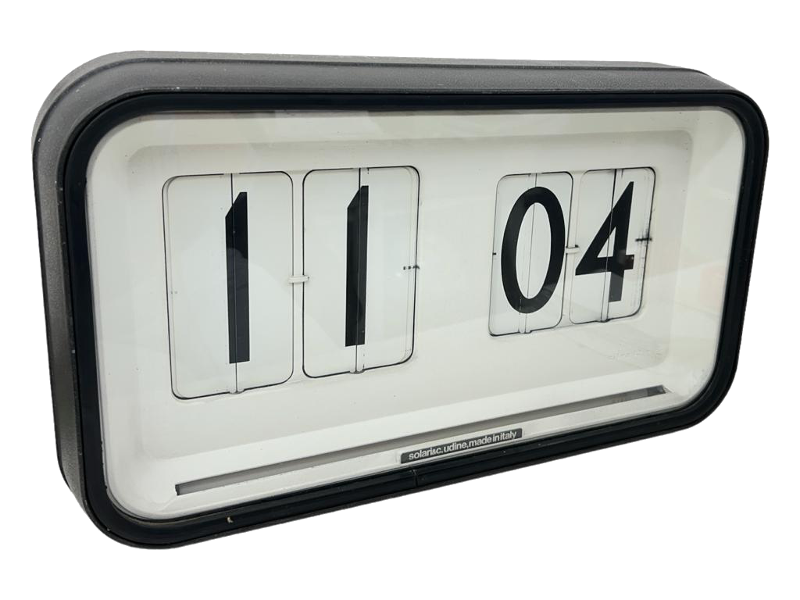
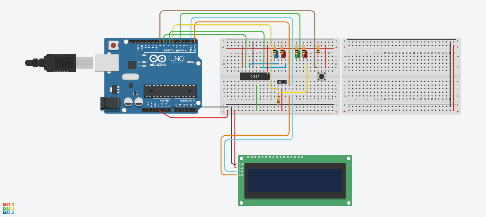
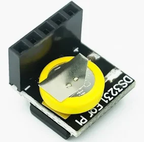
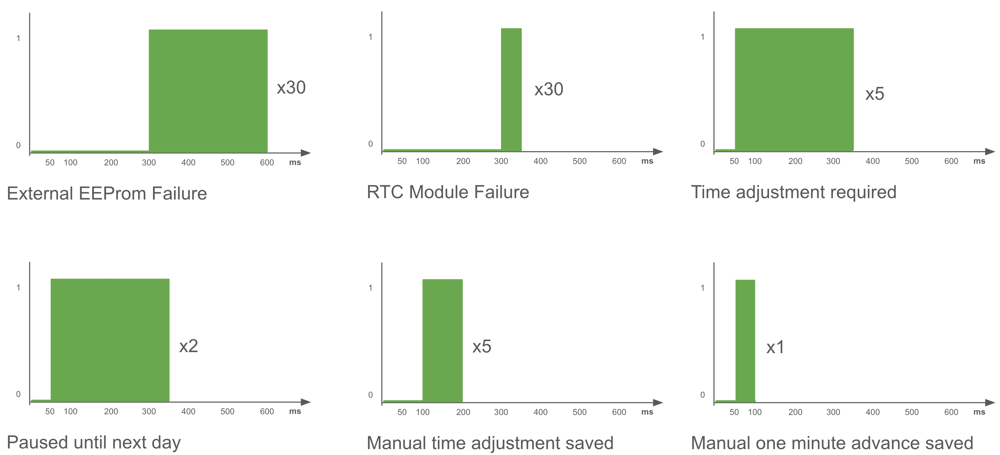
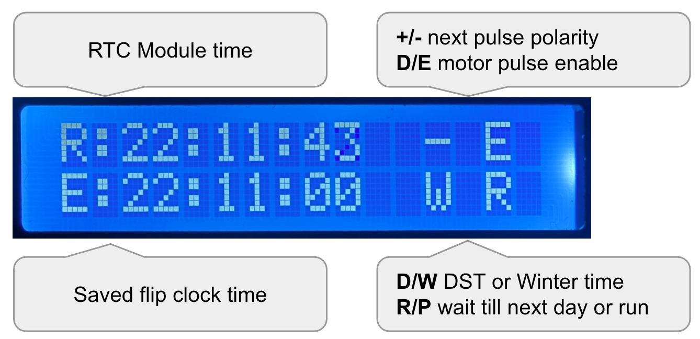

# Disclaimer
This is still a prototype, the circuit design was built and tested on a perfboard, the kicad board design was never tested.  use at your risk and plz **don't  come whining if you damage your flip clock or set your house on fire.**

# Solari Udine Auto Pilot

Arduino based Solari Udine Clock controller, suitable for alternating pulse Solari Udine Clock motors (i.e. Cifra 12). Controls hours and minutes, no calendar functions are provided. The current board design accepts a single Vcc in, either 12V or 24V, from an external power source. 

**Main features:**   
- Self adjusts after a power loss
- Handles DST (Central Europe rules)
- Allows manual adjustment
 

A led provides visual feedback, an optional LCD1602 can be plugged in to display status.

The software tries to mitigate strain on the flip clock limiting the number and frequency of rollers turns:
- Turns are limited to 1 every 3 seconds (manual step adjustment bypasses this)
- If the clock is more than 120 minutes behind, movement is paused till the next day (a halted clock displays the right time once a day after all **:-)**)
- If the eeprom or rtc module fail, no pulses are sent to the motor
- A hardware circuit limits pulse duration and frequency to 1 second.
- the circuit board has hardware protection avoiding prolonged motor pulses, set to 1 second. Once a pulse is sent, following ones are delayed until the hw protection has completed its cycle. Note that it is totally possible to build the board without the 555 timer, just hardwire L293D enable pins to high, software will work just fine.

The following features improve durability and operation:
- The system self restart once per week
- Eeprom writes are spread over a 256kbit eeprom, this should guarantee at least 20 years of operation before writes start to fail, more likely 50-70
- If eeprom stored time is unavailable, the clock halts until it is adjusted
- If RTC module is unavailable, the clock blinks for 30 seconds and then resets
- The Arduino will stay powered down approx 95% of the time during regular operation, saving considerable power. As a side effect, minutes will flip within +/- 2 seconds of when RTC time ticks a minute.  

## Dependencies

- [LiquidCrustal I2C](https://github.com/johnrickman/LiquidCrystal_I2C)
- [RTClib](https://github.com/adafruit/RTClib)
- [Regexp](https://github.com/nickgammon/Regexp)
- [SparkFun External EEPROM Arduino Library](https://github.com/sparkfun/SparkFun_External_EEPROM_Arduino_Library)
- [Rocket Scream Low Power](https://github.com/rocketscream/Low-Power)

## Circuit Board

**WORK IN PROGRESS** check the schematic in this repo, I've built and tested it on perfboard, board design might not be 100% correct, and definitely the layout could 
use some improvement.

**"Simplified"** board version uses some 30% less components removing the following features:

- Hardware limitation of pulses duration
- Paralleled L293D outputs

Considering how unlikely it is for the sketch to remain stuck with motor output set high, you might want to save yourself some hassle, expecially if you're building on perfboard.

I've built the board using these cheap DS3231 bought off Amazon, the design uses a male connector matching their Vcc-signal-signal-NC-Ground pinout, you might want to use something different and change the board design accordingly.
One good thing about these is they're small enough and can be easily swapped for testing and debugging

**How to read led signals**

Either for good or bad news, green led will flash. red will stay on when general enable switch is on

## How to install and adjust

**First things first, let's not fry stuff**
- If you built the board yourself, either run the Arduino sketch with  SET_COMPILE_TIME_TO_RTC flag turned on or use serial commands to prime the RTC module.
- Check your clock coil working voltage. Most accept 24V plus 12V or 48V with different wiring. **The current board design was tested with a 12 V external power source, 24V should work fine albeit with the tension regulator running hotter, 48V is beyond the regulator specs**
- Check your coil max current draw, one L293D with paralleled channels can drive up to 1200mA, no Solari Udine clock should draw more than that
- Unplug the clock, wire your power supply and the clock motor coil
- Turn the enable switch *OFF*
- Power the board.
 **No smoke? good.**
- On the first start, a manual time adjust is required,  "Time Adjustment Required" pattern will flash on the feedback led
- Manually adjust the clock flip rolls to match current time, the optional LCD display displays it on the first line
- Dial at least one minute advance with the button, this will prime pulse direction
- When the clock time matches RTC time, *Press the push button for 3 seconds until "Manual Time Adjustment Saved" pattern flashes*
- Turn the enable switch *ON*

The controller will now keep the flip clock display aligned with the internal RTC clock.

## Enabling motor movement

A switch allows to pause motor movement for maintenance and dialing in commands, the clock will catch up automatically once enable is resumed.
A led will remain **ON** while movement is paused.
the switch also disables deep sleep time and prepares the Arduino for accepting commands: wait until feedback led blinks once after pausing movement, then dial button or serial commands.

## Push buttons commands

*Important* only dial pushbutton commands with the motor enable switch turned off 

- Brief press: advances the clock 1 minute, led blinks briefly
- Three seconds press: aligns eeprom time with RTC time, for manual adjustment, led blinks on a pattern 

## Serial port commands

*Important* only dial serial commands with the motor enable switch turned off 

Commands format: **(<<|>>)[A-Z]{1,10}[a-z,A-Z,0-9]{1,20}**

- **<<** to read info, **>>** to set
- command name, in caps
- (where applicable) parameter

One command per line, max 32 chars long. the parser is pretty crude, pls stick to tested commands ;-) 

**Available commands**:

- **<<BOOTTIMESTAMP** prints the curent boot timestamp
- **>>COMPILEDATETIME** align RTC date and time to the sketch compilation timestamp
- **<<COMPILEDATETIME** print the sketch build timestamp
- **>>DAILYSECODNSOFFSET[+-][0-9]+$** (i.e: >>DAILYSECODNSOFFSET+10, DAILYSECODNSOFFSET+0, DAILYSECODNSOFFSET-20) stores the desided number of daily RTC error compensation to eeprom.
- **<<DAILYSECODNSOFFSET** print daily seconds of  RTC error correction setting stored in the eeprom
- **>>DATETIMEyyymmddhhmmss** (i.e: >>DATETTIME20241119235959) set RTC date and time, takes standard time, *not DST*.
- **<<EEPROMDATA** print eeprom date, time and clock status information
- **<<RTCDATETIME** print RTC date and time

## Build flags

-DEBUG_MODE enable serial port and LCD debug messages, disbales sleep time  and force reinitialization of eeprom and rtc module on each read
-SET_COMPILE_TIME_TO_RTC forces writing sketch build time to RTC on each boot, only use to program new rtc modules.

## Troubleshooting
**Q:** Instead of catching up the clock is standing still and the "Paused until next day" pattern flashes:

**A:** When more than 120 minutes are to be catched up, automatic adjustment will pause and wait for clock time to be right again the next day.

**Q:** The Arduino keeps resetting every half a minute or so, the feedback led flashes

**A:**  Either the eeprom or RTC clock aren't responding, the board needs fixing

**Q:**  I've hooked up a display, now what?

**A:** Note that the display only works when DEBUG_MODE flag is raised

**Q:**  How can I tell if my eeprom is corrupted or simply requires initialization?

**A:**  "Adj. time" on the display or "No valid time set in eeprom, please adjust clock" on the Serial are good news.

**Q:** My RTC module lost its time configuration!

**A:** >>DATETIME[0-9]+ command should fix it, however, if it happens again, the module batttery might be drained

**Q:** I can't tell what's going on with eeprom data

**A:** <<EEPROMDATA command can extracts all the info saved on the eeprom

**Q:** LCD doesn't display anyting, and/or serial messages are missing

**A:** set DEBUG_MODE build flag and upload firmware again

**Q:** **(serial|button) commands** are not working!

**A:** they only work reliably when motor movement is paused (solid red led), during regular operation the Arduino is awake and responding to commands for only few seconds per minute, good luck catching it awake! :-) 

**Q:** My clock drifts X seconds ahead/behind everyday

**A:** Buy a proper RTC module next time! :-) there's a handy feature to correct this, if the drift is the same every day, see serial commands

**Q:** My clock drifts X *minutes* ahead/behind everyday

**A:** Hikes! that's not OK! try a different RTC module, then check your board for errors on I2C bus pullup resistors and +5v power. I've tested the board design powering I2C devices straight from a tension regulator bypassing the Arduino's internal one, either do the same or dig  sleep configurations to figure how to keep the RTC powered during sleep. In case you figure something out, open a PR here :-)

**Q:** That PCB design is **lame**!

**A:** It is. any help much appreciated! ;-)

## Todo
- when disabling motion while sleep is skipped (i.e. 2 secs after a pulse), feedback led doens't blink
- Add support for bluetooth communication
- Improve kicad design
- Figure some predictable behavior for when RTC is known to be f*cked up, i.e start from 1970 and stop calculating dst

