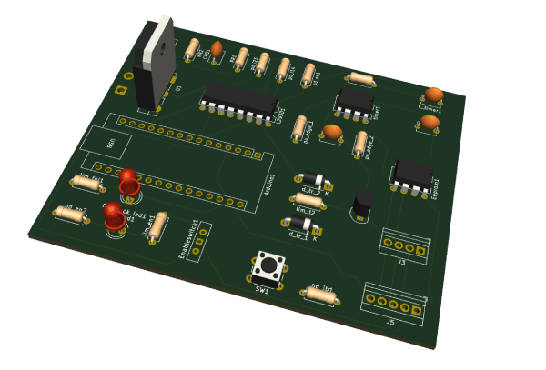

# Disclaimer
This is still a prototype, still to be tested on a real clock, use at your risk and plz **don't come whining if you damage your flip clock or set your house on fire.**

# Solari Udine Auto Pilot

Arduino based Solari Udine Clock controller, suitable for alternating pulse Solari Udine Clock motors (i.e. Cifra 12). Controls hours and minutes, not calendar functions are provided.

**Main features:**
- Self adjusts after a power loss
- Handles DST (Central Europe rules)
- Allows manual adjustment

A led provides visual feedback, an optional LCD1602 cab be plugged in to display status. 

The software tries to mitigate strain on the flip clock limiting the number and frequency of rollers turns:
- Turns are limited to 1 every 3 seconds (manual step adjustment bypasses this)
- If more than 120 roller flips would be require to catch up, movement is paused till the next day (a halted clock displays the right time once a day after all **:-)**)
- If the eeprom or rtc module fail, no pulses are sent to the motor

The following features improve durability and operation:
- The system self restart once per week
- Eeprom writes are spread over a 256kbit eeprom, this should guarantee at least 20 years of operation before writes start to fail, more likely 50-70
- If eeprom stored time is unavailable, the clock halts until it is adjusted
- If RTC module is unavailable, the clock blinks for 30 seconds and then resets

## Dependencies

- [LiquidCrustal I2C](https://github.com/johnrickman/LiquidCrystal_I2C)
- [RTClib](https://github.com/adafruit/RTClib)
- [SparkFun External EEPROM Arduino Library](https://github.com/sparkfun/SparkFun_External_EEPROM_Arduino_Library)

## Circuit Board
**to be updated**

[Tinkercad design](https://www.tinkercad.com/things/edBA37nszuH-solari-udine-autopilot?sharecode=Utxk19oz_5hmAhspum-ylxp-65AgX1UbVL5bwIXLegg)

**How to read led signals**

Either for good or bad news, green led will flash. red will stay on when general enable switch is on

## How to install and adjust

**First things first, let's not fry stuff**
- If you built the board yourself, power it on while hooked up to Arduino IDE at least once to prime the RTC module
- Check your clock coil working voltage, most accept 24V plus 12V or 48V with different wiring. **The current board design assumes both the coil and the arduino can be powered with 12V**
- Check your coil max current draw, one L293D with paralleled channels can drive up to 1200mA, no Solari Udine clock should draw more than that
- Unplug the clock, wire your 12V power supply and the clock motor coil 
- Turn the enable switch *OFF*
- Power the board
  
**No smoke? good.**
- On the first start, a manual time adjust is required,  "Time Adjustment Required" pattern will flash on the feedback led
- Manually adjust the clock flip rolls to match current time, the optional LCD display displays it on the first line
- Dial at least one minute advance with the button, this will prime pulse direction
- When the clock time matches RTC time, *Press the push button for 3 seconds until "Manual Time Adjustment Saved" pattern flashed*
- Turn the enable switch *ON*

The controller will now keep the flip clock display aligned with the internal RTC clock. 

## Troubleshooting
**Q:** Instead of catching up the clock is standing still and the "Paused until next day" pattern flashes:

**A:** When more than 120 minutes are to be catched up, it will pause and wait for RTC module time to realing on the next day to avoid straining the flip clock. 

**Q:** The arduino keeps resetting every half a minute or so, the feedback led flashes

**A:**  Either the eeprom or RTC clock aren't responding, the board needs fixing

**Q:**  I've hooked up a display, now what?

**A:** 

**Q:**(some random problem not covered here)

**A:** Hook up a serial cable, some debug info is sent through 

## Todo
- Add support for bluetooth communication
- Update/correct Tinkercad design
